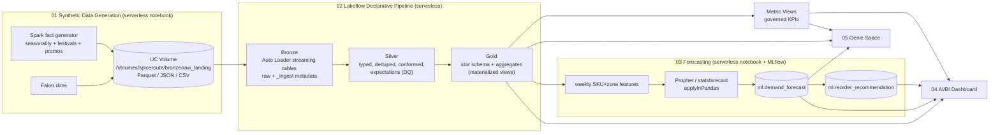
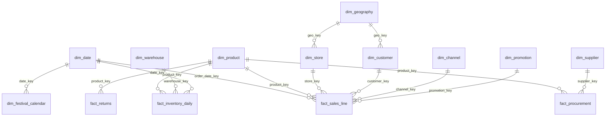

# SpiceRoute India — Retail Lakehouse Project Plan

> End-to-end Databricks project on **Databricks Free Edition**: synthetic big data → medallion lakehouse → demand forecasting → AI/BI dashboard → Genie.
>
> Status: **Planning** · Last updated: 2026-10-05

---

## 1. Business Context

**SpiceRoute India** (fictional) is a Mumbai-headquartered spice manufacturer and retailer selling packaged whole spices, ground spices, and masala blends across India.

| Aspect | Detail |
|---|---|
| Products | ~150 SKUs: 40 base spices/blends × pack sizes (50g, 100g, 200g, 500g, 1kg), standard & organic lines |
| Categories | Ground Spices, Whole Spices, Masala Blends, Premium (saffron, cardamom), Seasonings & Hing |
| Channels | General Trade (kirana via distributors), Modern Trade (supermarket chains), Own Stores, D2C Website, E-commerce Marketplaces, Quick Commerce, HoReCa (hotels/restaurants) |
| Geography | 6 zones (North, South, East, West, Central, North-East), 28 states + UTs, ~120 cities, Tier 1/2/3 |
| Currency / Tax | INR, GST 5% (ground/whole spices) and 12% (select blends) |
| Fiscal year | April–March (Indian FY) |

### Business questions the project must answer
1. How are revenue, volume, and margin trending by category, zone, and channel (YoY, MoM, FY)?
2. Which festivals and seasons drive which spices, and by how much?
3. How effective are promotions (lift vs. discount cost)?
4. What will demand be per SKU × zone for the next 12 weeks?
5. Which SKUs/warehouses are at risk of stockout, and what should we reorder?
6. How do raw-material (harvest) cost swings affect gross margin?

---

## 2. Platform Constraints — Databricks Free Edition

| Constraint | Impact on design |
|---|---|
| Serverless compute only (no classic clusters, no GPUs) | All notebooks/jobs/pipelines run serverless; Spark-native generation, no heavy local deps |
| One small SQL warehouse (Starter Warehouse) | Dashboards query **pre-aggregated gold tables**, not the 25M-row fact |
| Daily compute quota | Generate data once in batches; incremental re-runs; avoid repeated full rebuilds |
| Limited job/task concurrency | Keep job DAG linear-ish, few parallel tasks |
| Unity Catalog available | Use dedicated catalog if creatable, else fall back to `workspace` catalog |
| Model Serving / some AI features may be limited | Forecasting via batch notebooks; `ai_forecast()` used only if available (verified in Phase 0) |

### Phase 0 findings (verified 2026-10-05)

Project runs in a **dedicated, empty workspace** — fully separate from the existing retail POC (which lives in the `raj.s` workspace and is not touched at all).

| Check | Result |
|---|---|
| CLI profile | **`brilworks`** → `https://dbc-821c89ac-7917.cloud.databricks.com` (user `<your-user>`), authenticated |
| Workspace state | Empty: only `workspace` / `system` / `samples` catalogs, no jobs, no pipelines |
| Permissions | User is in `admins` group → can create catalog, jobs, pipelines, Genie spaces |
| SQL warehouse | `Serverless Starter Warehouse` (id `9cd430b8a1739112`, size Small, auto-stop) |
| `ai_forecast()` | **Available** — usable as SQL baseline forecast |
| Forecast model | **Prophet** (decided) |
| Catalog | **`spiceroute`** (to be created in Phase 0; fallback `workspace` if catalog creation needs a managed location) |

---

## 2a. Isolation

Because SpiceRoute has its own workspace, its compute quota, warehouse, catalogs, jobs, and dashboards are fully separate from the existing retail POC in the `raj.s` workspace. Within the new workspace we still keep things tidy:

| Asset | SpiceRoute convention |
|---|---|
| Unity Catalog | `spiceroute` catalog with `bronze`, `silver`, `gold`, `ml`, `semantic` schemas |
| Bundle | `spiceroute_india` → `/Users/<your-user>/.bundle/spiceroute_india/` |
| Jobs / pipelines | Prefixed `spiceroute_`, tagged `project=spiceroute` |
| MLflow experiment | `/Users/<your-user>/spiceroute/demand_forecast` |
| Local code | This folder (`db-prac/`) |
| Teardown | `databricks bundle destroy --profile brilworks` + `DROP CATALOG spiceroute CASCADE` |

## 3. Data Volume (Target: ~25M sales lines)

History window: **2023-10-01 → 2026-09-30** (3 years, 1,096 days).

| Table | Grain | Approx. rows | Generator |
|---|---|---|---|
| `fact_sales_line` | order line | **25,000,000** | Spark (vectorized) |
| `fact_orders` (header) | order | ~10,000,000 | Spark |
| `fact_inventory_daily` | warehouse × SKU × day | ~1,300,000 (8 WH × 150 SKU × 1,096 d) | Spark |
| `fact_procurement` | purchase order line | ~60,000 | Spark |
| `fact_returns` | return line | ~500,000 (~2%) | Spark |
| `dim_customer` | customer | ~1,000,000 | Faker + Spark |
| `dim_store` | store / outlet / distributor | ~2,500 | Faker |
| `dim_product` | SKU | ~150 | Curated list |
| `dim_promotion` | promotion | ~400 | Rules |
| `dim_date` | day | ~1,500 (incl. 12-week future) | Spark |
| `dim_festival_calendar` | festival × year | ~60 | Curated list |
| `dim_supplier` | supplier | ~50 | Faker |
| `dim_warehouse` | warehouse | 8 | Curated |

Raw landing size ≈ 2–3 GB Parquet; Delta gold ≈ 1–1.5 GB after compression.

---

## 4. Data Architecture



### Unity Catalog layout

```
spiceroute                       (catalog; fallback: workspace)
├── bronze                       raw ingested tables + volume raw_landing
├── silver                       cleaned/conformed entities
├── gold                         dimensional model + aggregates
├── ml                           features, forecasts, recommendations
└── semantic                     metric views for dashboard & Genie
```

### Layer responsibilities

| Layer | Purpose | Table type | Key rules |
|---|---|---|---|
| Bronze | Faithful copy of raw files | Streaming tables (Auto Loader) | Add `_ingest_ts`, `_source_file`; schema evolution `rescue` |
| Silver | Clean & conform | Streaming tables / MVs | Cast types, dedupe on business keys, standardize state/city names, `EXPECT` rules (drop/quarantine) |
| Gold | Analytics-ready star schema | Materialized views / tables | Surrogate keys, SCD1 dims (SCD2 for product price), liquid clustering |
| ML | Model inputs/outputs | Delta tables | Versioned by `run_id`, `forecast_date` |
| Semantic | Governed KPIs | Metric views | Single definition of revenue, margin, AOV, etc. |

### Intentional data-quality issues (to make the pipeline meaningful)
- ~0.5% duplicate order lines (bronze → removed in silver)
- ~0.3% null/invalid `store_id` (quarantined)
- Mixed state name spellings (`"Tamilnadu"`, `"Tamil Nadu"`, `"TN"`) → standardized
- Negative quantities that are actually returns → routed to returns
- Late-arriving files for some days

---

## 5. Data Model (Gold — Star Schema)



### 5.1 Dimensions

**`dim_product`** (SCD2 on price)
| Column | Type | Notes |
|---|---|---|
| product_key | BIGINT | surrogate |
| sku_id | STRING | e.g. `SR-TUR-GRD-200` |
| product_name | STRING | "SpiceRoute Turmeric Powder 200g" |
| base_spice | STRING | Turmeric, Red Chilli, Coriander, Cumin, Garam Masala, ... |
| category | STRING | Ground / Whole / Blend / Premium / Seasoning |
| sub_category | STRING | e.g. Biryani Masala → Blend/Rice |
| pack_size_g | INT | 50, 100, 200, 500, 1000 |
| is_organic | BOOLEAN | |
| mrp_inr | DECIMAL(10,2) | maximum retail price |
| unit_cost_inr | DECIMAL(10,2) | standard cost |
| gst_rate | DECIMAL(4,2) | 0.05 / 0.12 |
| shelf_life_days | INT | |
| launch_date | DATE | some SKUs launch mid-history |
| valid_from / valid_to / is_current | DATE/DATE/BOOLEAN | SCD2 |

**`dim_geography`**: geo_key, city, district, state, state_code, zone, tier (1/2/3), is_metro, population_band, lat, lon

**`dim_store`**: store_key, store_id, store_name, store_type (Own Store / Supermarket / Kirana / Distributor / HoReCa / Dark Store), geo_key, opened_date, size_band, sales_rep_id

**`dim_channel`**: channel_key, channel_name (General Trade, Modern Trade, Own Retail, D2C Web, Marketplace, Quick Commerce, HoReCa), channel_group (Offline/Online/B2B), margin_structure_pct

**`dim_customer`**: customer_key, customer_id, customer_type (Retail Consumer / Business), gender, age_band, geo_key, signup_date, loyalty_tier (None/Silver/Gold/Platinum), preferred_language (Hindi/Tamil/Telugu/Marathi/Bengali/Kannada/Gujarati/Malayalam/English)
> Only D2C, Own Retail, Marketplace, and Quick Commerce orders carry an identified customer; GT/MT use an anonymous customer key.

**`dim_promotion`**: promotion_key, promo_code, promo_name ("Diwali Dhamaka 20% Off"), promo_type (% off / BOGO / Combo / Free Gift), discount_pct, start_date, end_date, channel_scope, category_scope

**`dim_date`**: date_key (yyyymmdd), date, day_of_week, is_weekend, week_of_year, iso_week_start, month, month_name, quarter, calendar_year, fiscal_year (FY24-25), fiscal_quarter, season (Summer / Monsoon / Post-Monsoon / Winter), is_festival, festival_name, is_wedding_season, is_salary_week

**`dim_festival_calendar`**: festival_name, date, year, region_relevance (All-India / South / East / ...), lead_days, lag_days, expected_uplift_band

**`dim_warehouse`**: 8 warehouses — Delhi NCR, Mumbai (Bhiwandi), Kolkata, Chennai, Bengaluru, Hyderabad, Ahmedabad, Guwahati

**`dim_supplier`**: supplier_key, supplier_name, origin_state (Kerala pepper/cardamom, Andhra/Telangana chilli, Gujarat/Rajasthan cumin, Erode turmeric, J&K saffron…), primary_spice, reliability_score, lead_time_days

### 5.2 Facts

**`fact_sales_line`** — grain: one product line in an order (~25M rows)
| Column | Type | Notes |
|---|---|---|
| sales_line_id | STRING | |
| order_id | STRING | |
| order_date_key | INT | FK dim_date |
| order_ts | TIMESTAMP | |
| product_key, store_key, customer_key, channel_key, promotion_key | BIGINT | FKs (promotion_key = -1 when none) |
| warehouse_key | BIGINT | fulfilling warehouse |
| quantity | INT | units |
| volume_kg | DECIMAL | quantity × pack_size |
| mrp_inr | DECIMAL | |
| unit_selling_price_inr | DECIMAL | after channel margin |
| discount_inr | DECIMAL | promo + channel discount |
| gross_revenue_inr | DECIMAL | before discount |
| net_revenue_inr | DECIMAL | after discount, excl. GST |
| gst_inr | DECIMAL | |
| cogs_inr | DECIMAL | from cost-at-date |
| gross_margin_inr | DECIMAL | net_revenue − cogs |
| payment_mode | STRING | UPI / Card / COD / Credit (B2B) / Cash |
| is_returned | BOOLEAN | |

Physical design: **liquid clustering** on `(order_date_key, product_key)`; `OPTIMIZE` after load.

**`fact_orders`** — order header: order_id, order_ts, customer_key, store_key, channel_key, line_count, order_value_inr, delivery_city_key, delivery_days (online only)

**`fact_inventory_daily`** — warehouse × SKU × day: opening_qty, receipts_qty, shipped_qty, closing_qty, safety_stock_qty, days_of_cover, is_stockout

**`fact_procurement`** — po_id, po_date_key, supplier_key, product_key (or base spice), qty_kg, price_per_kg_inr, received_date_key, quality_grade

**`fact_returns`** — return_id, sales_line_id, return_date_key, reason (Damaged / Expired / Wrong item / Quality), qty, refund_inr

### 5.3 Gold aggregates (for dashboard performance)
| Table | Grain | Purpose |
|---|---|---|
| `agg_sales_daily` | date × product × zone × channel | Main dashboard source (~5M rows max) |
| `agg_sales_weekly_sku_zone` | ISO week × SKU × zone | Forecast training input |
| `agg_sales_monthly` | month × category × state × channel | Executive trends |
| `agg_promo_effectiveness` | promotion × category | Lift vs. baseline |
| `agg_customer_rfm` | customer | RFM segment for D2C customers |

---

## 6. Synthetic Data Generation Logic

Demand for each (SKU, store, day) = **base × trend × seasonality × festival × promo × regional preference × noise**

| Driver | Rule |
|---|---|
| Base demand | Product popularity rank (Zipf-like): turmeric, red chilli, coriander, garam masala = top sellers |
| Trend | +12% YoY overall; Online/Quick Commerce +40% YoY; General Trade +4% |
| Weekly | Weekend +15% (retail), month start (salary week) +10% |
| Seasonality | Winter ↑ warming spices (black pepper, ginger, cinnamon, clove); Summer ↑ chaat/jaljeera masala; Monsoon ↑ tea masala; Pickle season (Mar–May) ↑ mustard, fenugreek, red chilli |
| Festivals | Diwali (+60–90%, 2-week lead), Navratri/Durga Puja (East), Ganesh Chaturthi (West), Pongal/Onam (South), Eid (biryani masala, saffron +100%), Holi, Christmas (HoReCa cakes/cinnamon) |
| Wedding season | Nov–Feb, Apr–May: HoReCa & 1kg packs ↑ |
| Regional taste | South ↑ sambar/rasam powder, curry leaves, red chilli; North ↑ garam masala, kasuri methi; East ↑ panch phoron, mustard; West ↑ goda masala, kokum; NE ↑ local chilli |
| Promotions | 10–30% discount → 1.3–2.5× lift; post-promo dip |
| Supply shocks | One chilli crop shortage (2024) → cost +35%, intermittent stockouts in South |
| Noise | Poisson / negative-binomial counts |

Generation approach: Spark `range()` + vectorized expressions + broadcast joins to dim tables (no row-by-row Python); Faker only for customer/store/supplier names. Written to the volume in **monthly partitions** so it can be (re)generated in batches within the daily quota and to simulate incremental arrival for Auto Loader.

---

## 7. Forecasting Design

| Item | Decision |
|---|---|
| Target | Weekly `quantity` (units) per **SKU × zone** (~150 × 6 = 900 series) |
| Horizon | 12 weeks ahead |
| Training data | `gold.agg_sales_weekly_sku_zone`, ~156 weeks per series |
| Exogenous | Festival flags (week-level), promo intensity, price index, season |
| Baselines | Seasonal naive (last year same week); `ai_forecast()` SQL (confirmed available) |
| Main model | **Prophet** (with Indian festival holidays) per series via `groupBy().applyInPandas()`; alternative: `statsforecast` AutoETS/AutoARIMA (faster) |
| Validation | Rolling-origin backtest: last 3 × 12-week windows |
| Metrics | WAPE (primary), MAPE, bias — per series and aggregate |
| Tracking | MLflow experiment: params, metrics per run, champion model summary |
| Outputs | `ml.demand_forecast` (series, week, yhat, yhat_lower, yhat_upper, model, run_id), `ml.forecast_accuracy` |
| Inventory use | `ml.reorder_recommendation` = forecast demand over lead time + safety stock − on-hand → reorder qty, stockout risk flag, per warehouse × SKU |

Success criteria: aggregate WAPE ≤ 20% at SKU × zone weekly; forecasts beat seasonal-naive on ≥ 70% of series.

---

## 8. AI/BI Dashboard ("SpiceRoute Commercial Command Center")

| Page | Widgets |
|---|---|
| 1. Executive Overview | KPI counters (Net Revenue, Gross Margin %, Volume kg, Orders, AOV, YoY %); revenue trend by FY/month; channel mix; zone split; top 10 SKUs |
| 2. Product & Region | Category × zone heatmap; state-level map; regional taste index; organic vs. standard |
| 3. Festivals & Promotions | Festival uplift by spice; promo lift vs. discount cost; post-promo dip |
| 4. Demand Forecast | Actual vs. forecast with confidence band (SKU/zone filters); WAPE by category; next-12-week demand |
| 5. Inventory & Supply | Stockout risk table; days of cover by warehouse; reorder recommendations; raw-material cost trend vs. margin |
| 6. Data Health | DQ drop counts, table freshness, monitor drift metrics, active alerts |

Global filters: fiscal year, date range, zone, state, channel, category. All datasets query gold aggregates / metric views — never the raw 25M fact.

---

## 9. Genie Space ("Ask SpiceRoute")

- **Tables:** gold dims, `agg_sales_daily`, `agg_sales_monthly`, `agg_promo_effectiveness`, `ml.demand_forecast`, `ml.reorder_recommendation` (+ metric views)
- **Instructions:** fiscal year = Apr–Mar; revenue means `net_revenue_inr` excl. GST; "lakh" = 1e5, "crore" = 1e7; zone definitions; festival meaning
- **Sample questions:**
  - "What was net revenue in FY25-26 by zone, in crores?"
  - "Which spices grew the most during Diwali 2025 vs. Diwali 2024?"
  - "Which SKUs are at risk of stockout in Chennai warehouse in the next 4 weeks?"
  - "How did the 2024 chilli shortage affect gross margin in the South?"
  - "Top 5 promotions by revenue lift last quarter"
- **Trusted SQL** for 5–10 key questions; benchmark questions to evaluate accuracy.

---

## 10. Metric Views (Semantic Layer)

`semantic.sales_metrics` over `fact_sales_line` + dims:
- Measures: net_revenue, gross_margin, gross_margin_pct, volume_kg, units, orders, AOV, discount_rate, return_rate
- Dimensions: date (fiscal), product hierarchy, geography hierarchy, channel
Used by the dashboard and Genie so KPIs are defined once.

---

## 10a. Data Quality Monitoring

| Layer | Mechanism |
|---|---|
| Silver | Pipeline expectations (`EXPECT ... ON VIOLATION DROP ROW` / quarantine table) — counts surfaced in pipeline event log |
| Gold | Data quality monitoring (Lakehouse Monitoring) on `fact_sales_line` and `agg_sales_daily`: freshness, row-count drift, null rates, revenue distribution drift |
| ML | Inference-style monitor on `ml.demand_forecast` vs. actuals: WAPE drift over time |
| Alerts | Databricks SQL alerts: stockout-risk SKUs > threshold, forecast WAPE > 25%, pipeline DQ drop rate > 1% |
| Dashboard | "Data Health" page (page 6): DQ drop counts, freshness, monitor metrics |

## 10b. Databricks App — "SpiceRoute Demand Planner"

Interactive planner for supply-chain users (complements the read-only dashboard):
- Select zone / warehouse / SKU → see actuals, Prophet forecast with confidence band, `ai_forecast()` baseline
- Reorder recommendations table with editable override qty + approve/reject (overrides written to `spiceroute.ml.reorder_overrides`)
- Embedded "Ask SpiceRoute" Genie chat panel
- Stack: Databricks Apps (AppKit / React + TypeScript), reads gold/ml tables via the SQL warehouse, app service principal granted `SELECT` on `spiceroute` + `MODIFY` on overrides table only
- Free Edition note: apps auto-stop when idle; start on demand for demos

## 11. Orchestration & Project Structure

Single **Lakeflow Job** `spiceroute_end_to_end` — **manual trigger only (no schedule)** to conserve the daily compute quota:
```
generate_data (first run: full 3-year history; later runs: optional incremental batch)
   → run_pipeline (bronze → silver → gold)
      → optimize_gold
         → train_forecast (weekly schedule / on demand)
            → build_reorder_recommendations
               → refresh_dashboard
                  → refresh_quality_monitors
```

Deployed with a **Declarative Automation Bundle (DABs)**:

```
db-prac/
├── PLAN.md
├── databricks.yml                  # bundle `spiceroute_india`, target: free (profile brilworks)
├── resources/
│   ├── setup.job.yml               # catalog/schema/volume creation
│   ├── pipeline.yml                # Lakeflow Declarative Pipeline
│   ├── daily.job.yml               # orchestration job
│   └── dashboard.yml               # AI/BI dashboard
├── src/
│   ├── 00_setup/                   # create catalog, schemas, volume
│   ├── 01_generate/                # dims + facts generators, config (sizes, seed)
│   ├── 02_pipeline/                # bronze.py, silver.py, gold.sql
│   ├── 03_forecast/                # features, train, backtest, reorder
│   ├── 04_semantic/                # metric view YAML
│   ├── 05_genie/                   # genie space config + sample/trusted SQL
│   └── 06_quality/                 # DQ checks, monitors, alerts
├── app/                            # Databricks App: Demand Planner
├── resources/app.yml               # app resource
├── dashboards/
│   └── spiceroute_command_center.lvdash.json
└── docs/
    └── data_dictionary.md
```

---

## 12. Delivery Phases

| Phase | Scope | Done when |
|---|---|---|
| 0. Foundation | Confirm CLI profile & auth; verify Free Edition capabilities (catalog creation, `ai_forecast`, quotas); bundle scaffold; catalog/schemas/volume | `databricks bundle validate` passes; schemas exist |
| 1. Data generation | Reference lists (spices, cities, festivals); dim generators; fact generator; small run (100K) then full 25M | Row counts match targets; seasonality visible in quick checks |
| 2. Pipeline | Bronze Auto Loader, silver cleaning + expectations, gold star schema + aggregates, liquid clustering | Pipeline green; DQ metrics show dropped dupes/quarantine; FK integrity checks pass |
| 3. Semantic | Metric views | KPI totals reconcile to fact table |
| 4. Forecasting | Feature table, baselines (seasonal naive + `ai_forecast`), Prophet, backtest, MLflow, reorder logic | WAPE target met; forecast + reorder tables populated |
| 5. Dashboard | All SQL tested via CLI, then dashboard deployed via bundle | 6 pages render on the Starter Warehouse in < 10s each |
| 6. Genie | Space, instructions, trusted SQL, benchmarks | ≥ 80% benchmark questions answered correctly |
| 7. Data quality | Monitors, SQL alerts, Data Health dashboard page | Monitors refresh; alerts fire on injected test anomaly |
| 8. Databricks App | Demand Planner app deployed via bundle | Forecast view + reorder override round-trip works |
| 9. Orchestration | Manual end-to-end job (no schedule) | One-click run succeeds end to end |
| 10. Docs | Data dictionary, README, demo script | Ready for demo |

---

## 13. Risks & Mitigations

| Risk | Mitigation |
|---|---|
| Free Edition compute quota exhausted during 25M generation | Generate per month in batches; start with 100K test; seed-based so reruns are deterministic |
| Accidental impact on existing retail POC | Separate workspace (`brilworks`) — no shared resources |
| Prophet install slow/unavailable on serverless | Fall back to `statsforecast` (lighter) or `ai_forecast()` |
| Dashboard slow on small warehouse | Only aggregate tables; liquid clustering; limit date ranges |
| Synthetic data too "clean" / unrealistic | Injected DQ issues, noise, supply shock, late-arriving data |
| Genie wrong answers | Instructions + trusted SQL + metric views + benchmark evaluation |

---

## 14. Decisions
- [x] CLI profile: `brilworks` (dedicated workspace `dbc-821c89ac-7917`)
- [x] Catalog: `spiceroute` (new, isolated)
- [x] Forecast model: Prophet; `ai_forecast()` as SQL baseline
- [x] Data size: ~25M sales lines, India-focused brand
- [x] Separate workspace: `brilworks`
- [x] Run mode: manual trigger (no schedule)
- [x] Version control: local git (commit per phase), no remote
- [x] Extras: metric views, Databricks App (Demand Planner), data quality monitoring
