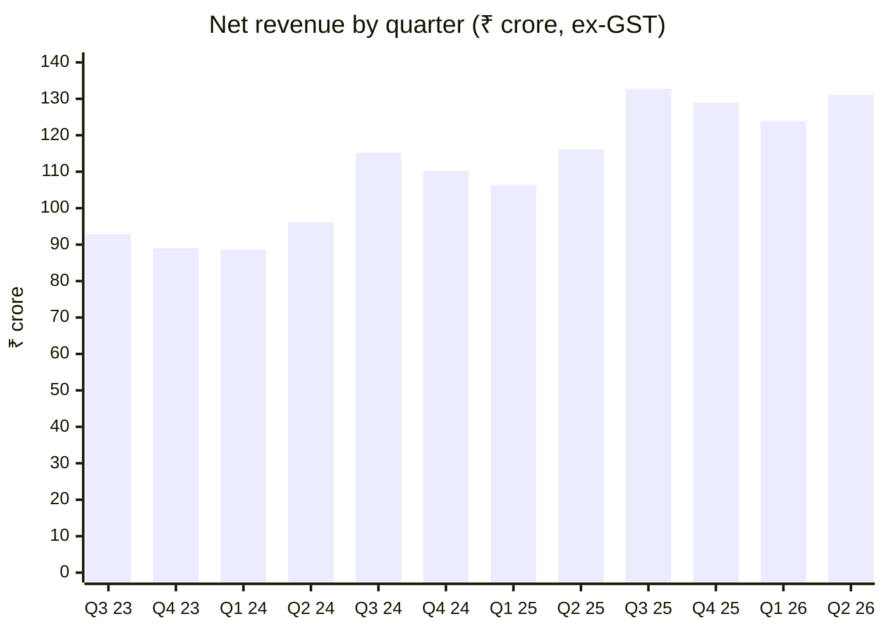
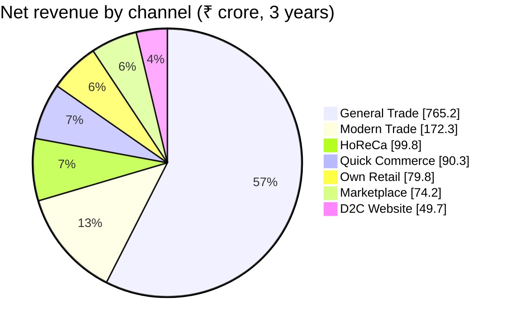
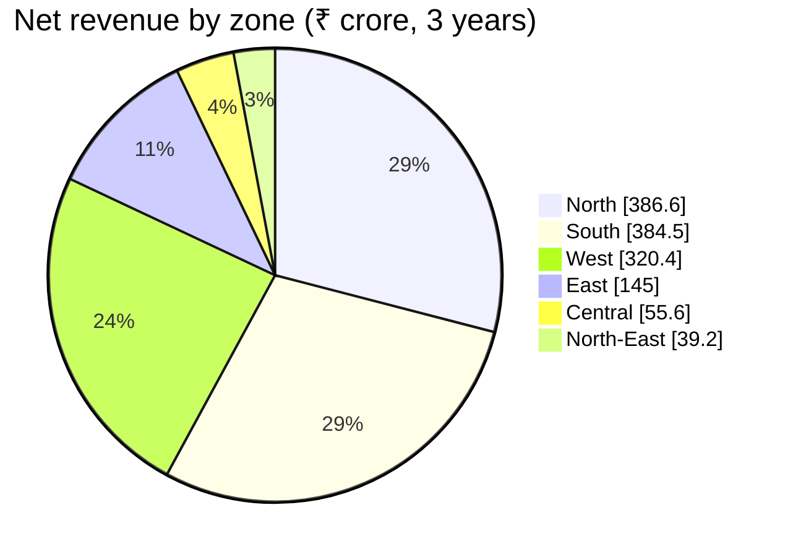
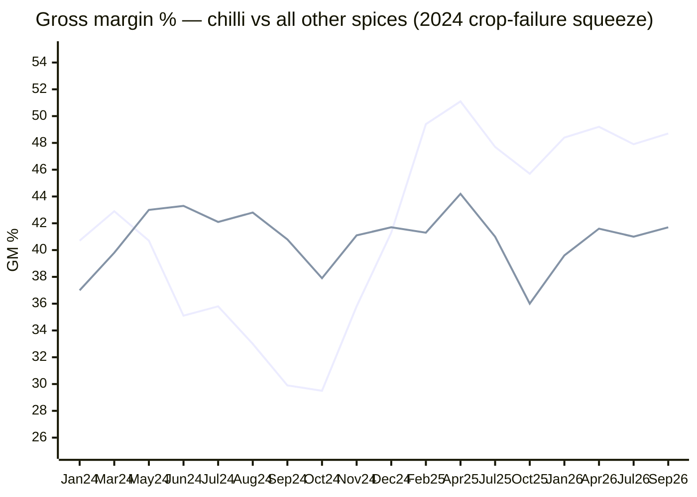
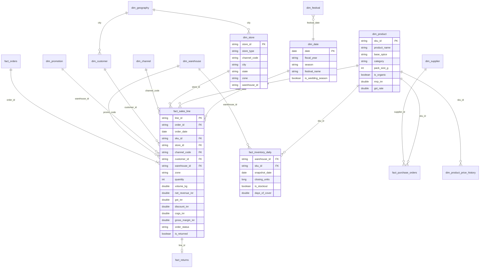
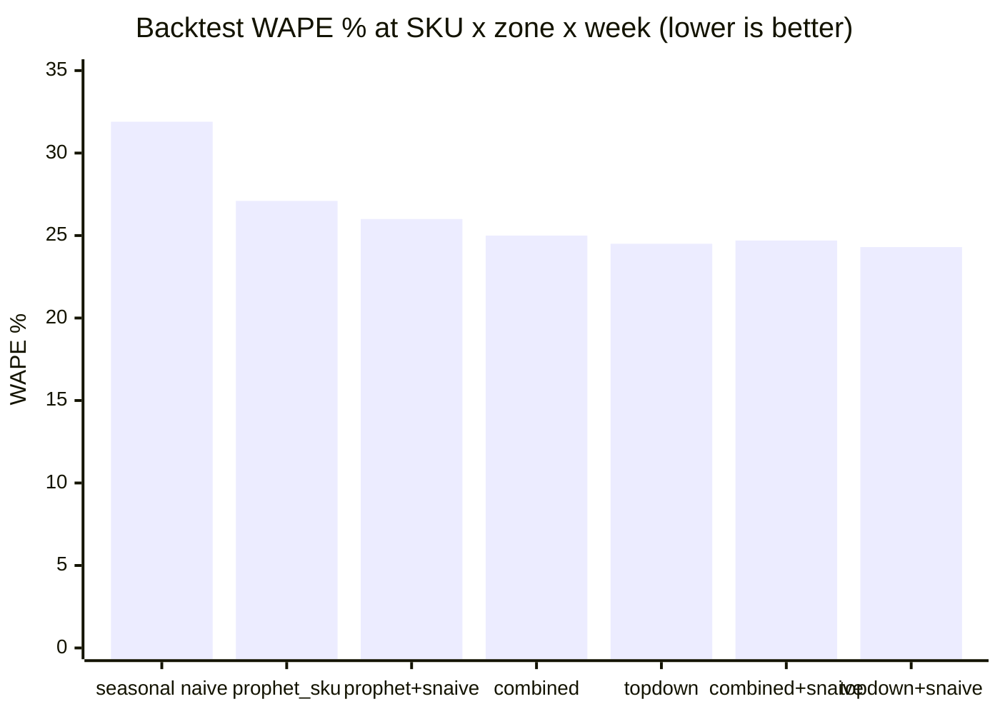
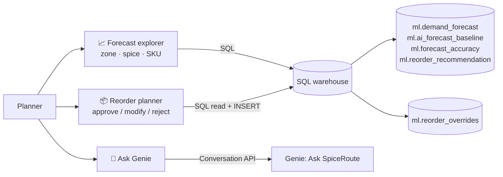
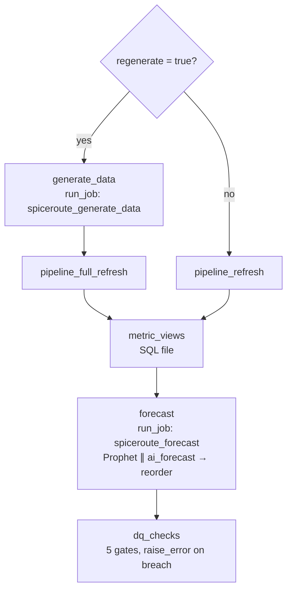

# SpiceRoute India — Retail Lakehouse on Databricks Free Edition

End-to-end Databricks project for a fictional Indian spice company. **SpiceRoute India** sells 147 SKUs through 7 channels across 6 zones.

The project covers:
1. **Synthetic big data:** about 25M sales lines, 10M orders and 1M customers over 3 years.
2. A **medallion lakehouse** built with a Lakeflow Declarative Pipeline (bronze → silver → gold).
3. **Governed KPIs** as Unity Catalog metric views.
4. **Demand forecasting** with Prophet and the `ai_forecast()` baseline, tracked in MLflow.
5. **Reorder and stockout recommendations**.
6. An **AI/BI dashboard**, a **Genie space** and a **Databricks App**.

> Workspace: `https://dbc-821c89ac-7917.cloud.databricks.com` · CLI profile: `brilworks` · Catalog: `spiceroute`
> Everything is deployed as a Declarative Automation Bundle (`databricks.yml`). The project is fully isolated from other projects (own workspace, own catalog).

---

## 📌 Project status (updated 2026-10-05)

All planned phases are built and deployed in the `brilworks` workspace.

| # | Phase | Status | Result |
|---|---|---|---|
| 0 | Foundation | ✅ | Bundle `spiceroute_india`; catalog `spiceroute` (schemas `bronze`, `silver`, `gold`, `ml`, `semantic`, `synthetic`) |
| 1 | Synthetic data | ✅ | Job `spiceroute_generate_data`: 25.47M raw lines, 10.4M orders, 1M customers, inventory and purchase orders |
| 2 | Medallion pipeline | ✅ | Pipeline `spiceroute_medallion` (serverless SQL, about 4 min); 25.18M clean gold lines |
| 3 | Semantic layer | ✅ | Metric views `sales_metrics`, `order_metrics`, `inventory_metrics` |
| 4 | Forecasting | ✅ | Hierarchical Prophet (base spice × zone, split to 882 SKU series) blended with seasonal naive; champion chosen from 6 candidates by backtest. WAPE is **17.3%** at spice × zone (planning level, meets the ≤20% target) and **24.3%** at SKU × zone × week. It beats seasonal naive on **94.8%** of series, and the calibrated 80% intervals cover **82%** on a held-out fold |
| 4c | Reorder recommendations | ✅ | `ml.reorder_recommendation`: 162 high-risk, 499 medium-risk and 515 low-risk DC × SKU items |
| 5 | AI/BI dashboard | ✅ | 6 pages plus a filters page, published, with the Genie button linked |
| 6 | Genie space | ✅ | "Ask SpiceRoute": 17 tables, 3 metric views, 8 example SQL queries (each one tested) and 8 benchmark questions |
| 7 | Data quality | ✅ | Pipeline expectations and quarantine tables; `gold.dq_summary`; 5-check DQ gate task; 3 SQL alerts (paused) |
| 8 | Databricks App | ✅ | "Demand Planner" (Streamlit): forecast explorer, reorder approvals saved to `ml.reorder_overrides`, Genie chat. Verified headless with Streamlit `AppTest` against live data (all tabs and Genie, no errors) and the write path tested |
| 9 | Orchestration | ✅ | `spiceroute_end_to_end`: one-click manual run, with an optional data rebuild. Verified 2026-10-05: all tasks SUCCESS, incremental rerun is idempotent (row counts unchanged) |
| 10 | Docs | ✅ | This README and `PLAN.md` |

### 🔗 Links
| Asset | Link |
|---|---|
| Dashboard (published) | https://dbc-821c89ac-7917.cloud.databricks.com/sql/dashboardsv3/01f1c0bd2fb31f4fa957edeceee74365/published |
| Genie space | https://dbc-821c89ac-7917.cloud.databricks.com/genie/rooms/01f1c0bd7bd6175ba0b691784fd34971 |
| Demand Planner app | https://spiceroute-demand-planner-7474657342127486.aws.databricksapps.com |
| MLflow experiment | `/Users/<your-user>/spiceroute/demand_forecast` |
| Jobs | `spiceroute_end_to_end`, `spiceroute_generate_data`, `spiceroute_forecast` (Workflows UI) |
| Pipeline | `spiceroute_medallion` |

### Known gaps / next ideas
- **SKU-level noise floor.** At SKU × zone × week, even a one-week-ahead 4-week moving average only reaches 25% WAPE, because bulk distributor orders make weekly SKU volumes lumpy. That's why the forecast is evaluated, and planned, at base spice × zone, where it reaches 17.3%. Next ideas:
  - LightGBM on lag and festival features as an extra candidate;
  - MinT (optimal) hierarchical reconciliation instead of top-down shares.
- **Alerts are paused** to protect the Free Edition quota. The same thresholds are enforced on every manual run by the `dq_checks` task. Unpause them in the UI if you want the emails.

## 1. Business story

| Aspect | Detail |
|---|---|
| Company | SpiceRoute India (fictional), Mumbai HQ, packaged spices |
| Products | 147 SKUs: 46 base spices × pack sizes (1g saffron to 1kg), plus an organic line launched Aug 2024 |
| Categories | Ground Spices, Whole Spices, Masala Blends, Seasonings, Premium |
| Channels | General Trade (distributors), Modern Trade, Own Retail, HoReCa, Quick Commerce, Marketplace, D2C Website |
| Geography | 6 zones, 32 states/UTs, 111 cities, 8 distribution centres |
| Period | Actuals 2023-10-01 → 2026-09-30 (Indian FY Apr–Mar); forecasts to Dec 2026 |
| Money | INR. MRP includes GST. **Revenue = net revenue excluding GST**, after channel margin and promotional discount |

### Stories built into the data
1. **Festivals drive demand.** Diwali, Navratri, Durga Puja (East), Ganesh Chaturthi (West), Onam and Pongal (South), Eid, Holi and Christmas each lift specific spices. For example, Eid lifts biryani masala and saffron, Durga Puja lifts panch phoron, and Holi lifts thandai spices. B2B sell-in leads consumer sell-out by about 10 days.
2. **Regional taste.** Sambar powder is about 47% of the South's volume among core spices, against about 6% elsewhere. Panch phoron is popular in the East, goda masala in the West, and garam masala in the North.
3. **2024 chilli crop failure (Andhra/Telangana).** Raw chilli cost rose by up to +38%. Suppliers refused allocations, and a low-grade alternate supplier (grade C) was used. The effects:
   - stockouts in South and West DCs (fill rate down to 62–67%)
   - quality returns increased
   - chilli gross margin fell from 44.6% to 29.5%
   - an MRP increase of +12% in July 2024 later restored the margin.
4. **Channel shift.** Quick commerce (+20% per store per year, plus new dark stores), marketplace (+30%) and D2C (+22%) grow faster than General Trade (+4%).
5. **Promotions.** Festival promos and flash sales lift revenue, followed by a post-promo dip.
6. **Seasonality.** Warming spices peak in winter, chaat and jaljeera in summer, tea masala in the monsoon, and pickle spices in March–May.

### Headline numbers (from gold)


*(Quarter labels are calendar quarters by start month: Oct 2023 … Jul 2026.)*

| Fiscal year | Net revenue | Gross margin |
|---|---|---|
| FY23-24 (Oct–Mar only) | ₹181.9 cr | 39.2% |
| FY24-25 | ₹410.4 cr | 41.1% |
| FY25-26 | ₹484.0 cr (+18%) | 41.1% |
| FY26-27 (Apr–Sep) | ₹254.9 cr | 42.7% |






*Line 1 = chilli SKUs, line 2 = all other spices.*

---

## 2. Architecture

```mermaid
flowchart LR
    subgraph GEN["① spiceroute_generate_data (serverless job)"]
        D1[gen_dims.py<br/>Faker en_IN · reference data<br/>stores · 1M customers · promos]
        D2[gen_sales.py<br/>demand model → 10.4M orders<br/>→ 25.5M lines · returns]
        D3[gen_inventory.py<br/>(s,S) replenishment sim<br/>inventory · purchase orders]
        D1 --> D2 --> D3
    end
    V[("UC Volume<br/>spiceroute.bronze.raw_landing<br/>Parquet · JSON · CSV")]
    GEN --> V
    subgraph LDP["② spiceroute_medallion (Lakeflow Declarative Pipeline, serverless SQL)"]
        B["BRONZE<br/>Auto Loader streaming tables<br/>+ reference MVs"]
        S["SILVER<br/>typed · deduped · standardised<br/>expectations + quarantine"]
        G["GOLD<br/>star schema · facts · aggregates<br/>liquid clustering"]
        B --> S --> G
    end
    V --> B
    G --> MV["③ SEMANTIC<br/>metric views<br/>sales · orders · inventory"]
    subgraph FC["④ spiceroute_forecast (serverless job)"]
        P[Prophet per SKU×zone<br/>applyInPandas · festivals as holidays]
        A[ai_forecast() baseline<br/>SQL warehouse]
        R[reorder_recommendations]
        P --> R
    end
    G --> FC
    FC --> ML[("ml.demand_forecast<br/>ml.forecast_accuracy<br/>ml.reorder_recommendation")]
    P -. metrics .-> MLF[(MLflow experiment)]
    MV --> DB["⑤ AI/BI Dashboard"]
    ML --> DB
    MV --> GN["⑥ Genie: Ask SpiceRoute"]
    ML --> GN
    ML --> APP["⑧ Databricks App<br/>Demand Planner"]
    APP -->|overrides| OV[(ml.reorder_overrides)]
```

### Unity Catalog layout

```
spiceroute
├── bronze      raw_landing volume + *_raw tables (Auto Loader / read_files)
├── silver      cleaned entities + orders_quarantine, sales_lines_quarantine
├── gold        dim_* / fact_* / agg_* / dq_summary
├── semantic    sales_metrics, order_metrics, inventory_metrics (metric views)
├── ml          demand_forecast, forecast_backtest, forecast_accuracy, ai_forecast_baseline,
│               reorder_recommendation, reorder_overrides
└── synthetic   generator ground truth / helper tables (not used by analytics)
```

### Platform choices for Free Edition
- **Serverless everywhere:** jobs use `environments` (client 4) and the pipeline is `serverless: true`. There are no clusters.
- **Small warehouse:** dashboards and Genie read pre-aggregated gold tables and metric views, never the 25M-row fact table directly.
- **Manual triggers only:** jobs have no schedules, to save the daily compute quota.

---

## 3. Data volumes

| Table | Rows |
|---|---|
| `bronze.sales_lines_raw` | 25,466,593 |
| `silver.sales_lines` | 25,258,597 |
| `gold.fact_sales_line` | 25,183,186 |
| `gold.fact_orders` | 10,434,220 |
| `gold.agg_sales_daily` | 3,881,046 |
| `gold.fact_inventory_daily` | 1,288,896 |
| `gold.dim_customer` | 1,000,000 |
| `gold.fact_returns` | 429,986 |
| `gold.fact_purchase_orders` | 44,145 |
| `gold.dim_store` | 2,134 |
| `gold.dim_product` | 147 |

### Data-quality issues injected and caught

| Source | Issue | Rows | Handling |
|---|---|---|---|
| sales_lines | exact duplicate lines | 126,818 | deduplicated in silver → quarantine |
| sales_lines | missing price | 32,951 | expectation DROP → quarantine |
| sales_lines | unknown SKU | 27,929 | expectation DROP → quarantine |
| sales_lines | non-positive quantity | 20,298 | expectation DROP → quarantine |
| orders | missing store_id | 31,492 | expectation DROP → `orders_quarantine` |
| sales_lines | late-arriving (next month's batch folder) | 251,971 | accepted, flagged `arrived_late` |
| stores | messy state names (`Tamilnadu`, `WB`, `Orissa` …) | 102 | standardised in silver |

---

## 4. Data model (gold star schema)



Design notes:
- **Business keys as join keys.** Tables join on `sku_id`, `store_id` and similar, which makes Genie and ad-hoc SQL simpler.
- **Price history.** MRP history is kept as SCD Type 2 in `dim_product_price_history`. Monthly cost comes from `silver.product_costs`.
- **Clustering.** Large tables use liquid clustering: `fact_sales_line (order_date, sku_id)` and `agg_sales_daily (order_date, zone)`.

| Gold aggregate | Grain | Used by |
|---|---|---|
| `agg_sales_daily` | day × SKU × zone × channel | dashboard, Genie, `sales_metrics` |
| `agg_sales_monthly` | month × category × state × channel | executive trends, map |
| `agg_sales_weekly_sku_zone` | week × SKU × zone | forecasting input |
| `agg_promo_effectiveness` | promotion | promo lift vs 28-day baseline |
| `agg_festival_uplift` | festival × zone × spice | festival analysis |
| `agg_customer_rfm` | customer | RFM segments |
| `agg_inventory_weekly` | week × warehouse × SKU | fill rate, stockout days |
| `agg_margin_monthly` | month × base spice | raw-material index vs margin |
| `dq_summary` | table × reason | data health |

---

## 5. Forecasting design

| Item | Choice |
|---|---|
| Target | Weekly units per SKU × zone (882 series) |
| Horizon | 12 weeks (trained through the week of 2026-09-21) |
| Base model | Prophet: multiplicative yearly seasonality, Indian festivals as holidays (festival week and the week before), `promo_share` regressor |
| Hierarchy | Prophet is also fitted per **base spice × zone** (smoother series), then split to SKUs by each SKU's trailing 12-week share (top-down) |
| Candidates | `prophet_sku`, `topdown`, `combined`, each also blended 0.7/0.3 with seasonal naive. The lowest backtest WAPE wins: currently **topdown+snaive** |
| Intervals | Split-conformal 80% intervals: the 10th and 90th percentiles of actual/forecast ratios per category × zone from the backtest. Coverage is checked on a held-out fold (82%) |
| Short-history SKUs | Recent 8-week mean (products launched in 2024–25) |
| Baselines | Seasonal naive (same week last year); Databricks `ai_forecast()` |
| Validation | Rolling-origin backtest, 3 folds × 12 weeks; WAPE, bias, 80% interval coverage |
| Tracking | MLflow experiment `/Users/<your-user>/spiceroute/demand_forecast` |
| **Backtest result** | See the table below. Champion bias is −1.7%. It beats seasonal naive on **94.8%** of series. Holdout interval coverage is 82% |

| Candidate | WAPE, SKU × zone × week | WAPE, base spice × zone × week |
|---|---|---|
| prophet_sku (direct) | 27.1% | 18.3% |
| topdown | 24.5% | 18.1% |
| combined | 25.0% | 18.1% |
| prophet_sku + snaive | 26.0% | 17.4% |
| **topdown + snaive (champion)** | **24.3%** | **17.3%** |
| combined + snaive | 24.7% | 17.3% |
| seasonal naive | 31.9% | 21.9% |


| Inventory link | Zone forecast allocated to DCs by recent demand share, giving lead-time demand + safety stock − (on hand + open POs) = reorder quantity and stockout risk |

---

## 6. AI/BI dashboard: "SpiceRoute Commercial Command Center"

Built by `dashboards/build_dashboard.py`, which generates `spiceroute_command_center.lvdash.json`. It's deployed as a bundle resource with `dataset_catalog: spiceroute` and `dataset_schema: gold`. All 16 dataset queries are tested with `--test`.

| Page | Widgets |
|---|---|
| 1 · Executive Overview | KPI sparklines (net revenue, GM %, orders, AOV); monthly revenue by channel group with Diwali markers; channel mix; revenue by zone; top spices; GM % by category |
| 2 · Product & Region | Category × zone heatmap; state bubble map; spice × zone volume pivot; volume by season |
| 3 · Festivals & Promotions | Daily revenue by zone with festival markers; biggest festival uplifts; promotion lift table; promo revenue share by channel |
| 4 · Demand Forecast | WAPE and interval-coverage KPIs; actuals + champion forecast-line with calibrated 80% band; champion vs direct Prophet vs `ai_forecast()` vs seasonal naive; WAPE by category; candidate-model leaderboard |
| 5 · Inventory & Supply | Fill-rate and high-risk KPIs; chilli vs other fill rate (crop-failure marker); chilli margin squeeze with MRP-hike marker; stockout days by DC; supplier scorecard; colour-coded reorder table |
| 6 · Customers & Data Health | RFM segments; customer value by loyalty tier; rows through the medallion layers; DQ outcomes by reason |
| Filters | Date, zone, channel, category, stockout risk, festival, fiscal year, warehouse |

## 7. Genie space: "Ask SpiceRoute"

Built by `src/05_genie/build_genie_space.py`. Use `--test` to run every example SQL query and `--deploy` to create or update the space.

- **Data:** 16 gold and ml tables plus the 3 metric views. Entity matching is switched on for spice, zone, channel, festival, DC and risk columns.
- **Instructions:**
  - revenue = net of GST, delivered orders only;
  - FY = April–March (labelled FY25-26);
  - lakh and crore conversions;
  - chilli = `RCH`/`KCH`;
  - "DC" = warehouse;
  - prefer metric views and aggregate tables, never the 25M-row fact table.
- **Example and benchmark questions:**
  - Net revenue by zone in FY25-26 in crores
  - Which spices grew most during Diwali 2025 vs 2024
  - Which SKUs are at high stockout risk at the Chennai DC
  - How the 2024 chilli shortage affected margin
  - Top promotions by lift
  - Garam masala forecast in the North
  - Online revenue share by year
- **Test:** asked "Which zone had the highest gross margin % in FY25-26?", Genie correctly used `MEASURE(\`Gross Margin Pct\`)` on `semantic.sales_metrics`.

## 8. Databricks App: "SpiceRoute Demand Planner"

`app/` is a Streamlit app, deployed as a bundle resource. Its resources are the SQL warehouse (`CAN_USE`) and the Genie space (`CAN_RUN`). The app's service principal has `SELECT` on `gold`, `ml` and `semantic`, plus `MODIFY` on `ml.reorder_overrides`.



- **Forecast explorer:** actuals vs the champion forecast (with calibrated 80% band), `ai_forecast()` and seasonal naive, plus backtest WAPE for the current selection.
- **Reorder planner:** editable table of recommendations. Decisions are stored with the planner's email and a timestamp, and the latest decision is shown next to each item.
- **Ask Genie:** chat that shows Genie's answer, the result table and the generated SQL.

## 9. Data quality & orchestration



| Layer | Mechanism |
|---|---|
| Silver | Expectations (`ON VIOLATION DROP ROW`); rejects land in `orders_quarantine` / `sales_lines_quarantine` |
| Gold | `dq_summary`: quarantined rows by reason, late-arriving lines, corrected state names |
| Gate (`dq_checks.sql`) | Reject rate ≤ 1%; no orphan SKUs in the fact table; metric view = gold revenue; freshness (actuals reach 2026-09-30); 12 forecast weeks present |
| Alerts (paused) | High-risk items > 100; backtest WAPE > 30%; DQ reject rate > 1%. Email goes to the deployer |

## 10. Repository layout

```
db-prac/
├── databricks.yml                         bundle (target free → profile brilworks)
├── PLAN.md · README.md
├── resources/
│   ├── generate_data.job.yml              synthetic data job (3 tasks)
│   ├── medallion.pipeline.yml             Lakeflow Declarative Pipeline
│   ├── forecast.job.yml                   Prophet + ai_forecast + reorder
│   ├── demand_forecast.experiment.yml     MLflow experiment
│   ├── command_center.dashboard.yml       AI/BI dashboard
│   ├── quality.alerts.yml                 3 SQL alerts (paused)
│   ├── demand_planner.app.yml             Databricks App
│   └── end_to_end.job.yml                 one-click orchestration
├── src/
│   ├── 01_generate/                       spice_common.py · gen_dims.py · gen_sales.py · gen_inventory.py
│   ├── 02_pipeline/transformations/       01_bronze.sql … 05_gold_aggregates.sql
│   ├── 03_forecast/                       train_forecast.py · ai_forecast_baseline.sql · reorder_recommendations.py
│   ├── 04_semantic/                       metric_views.sql
│   ├── 05_genie/                          build_genie_space.py · genie_space.json
│   └── 06_quality/                        dq_checks.sql
├── dashboards/                            build_dashboard.py · spiceroute_command_center.lvdash.json
└── app/                                   app.py · app.yaml · requirements.txt
```

## 11. How to run

```bash
databricks bundle validate --strict --profile brilworks
databricks bundle deploy --profile brilworks

# everything, reusing the existing data (~15 min)
databricks bundle run spiceroute_end_to_end --profile brilworks
# everything, rebuilding the 25M-line dataset first (~35 min)
databricks bundle run spiceroute_end_to_end --params regenerate=true --profile brilworks

# individual pieces
databricks bundle run spiceroute_generate_data --params target_lines=500000 --profile brilworks   # small test set
databricks bundle run spiceroute_medallion --profile brilworks
databricks bundle run spiceroute_forecast --profile brilworks
databricks bundle run spiceroute_demand_planner --profile brilworks                             # (re)deploy app source

# dashboard / Genie definitions are generated from code
python3 dashboards/build_dashboard.py --test && databricks bundle deploy --profile brilworks
python3 src/05_genie/build_genie_space.py --test
GENIE_SPACE_ID=01f1c0bd7bd6175ba0b691784fd34971 python3 src/05_genie/build_genie_space.py --deploy
```

**Gotchas:**
- **Prophet on serverless:** pin `cmdstanpy==1.2.5`. Version 1.3.x rejects the CmdStan bundled in the prophet 1.1.6 wheel ("missing makefile").
- **Metric-view YAML:** submit it through the SQL warehouse (job `sql_task` or the Statement Execution API). The `aitools query` helper strips indentation and breaks the YAML.
- **Regenerating data:** raw files are overwritten in place, so the pipeline needs a **full refresh** afterwards. The end-to-end job does this automatically when `regenerate=true`.

**Teardown:**
1. Run `databricks bundle destroy --profile brilworks`.
2. Run `DROP CATALOG spiceroute CASCADE`.
3. Delete the Genie space in the UI.

## 12. Demo script (10 minutes)

1. **Dashboard, page 1:** ₹484 cr in FY25-26 (+18%). General Trade is the core channel, but online is growing fastest. Diwali markers show the festive peaks.
2. **Page 2:** regional taste. Sambar is big in the South, panch phoron in the East, goda masala in the West.
3. **Page 5:** the 2024 chilli crop failure. Fill rate collapses in South and West DCs, the margin squeeze is visible, and margin recovers after the MRP hike. The supplier scorecard shows the grade-C alternate supplier.
4. **Page 4:** hierarchical Prophet forecast with festival effects. It reaches 17.3% WAPE at planning level and beats the seasonal baseline on 95% of series. Show the candidate leaderboard.
5. **Ask Genie:** "Which SKUs are at high risk of stockout at the Chennai DC?"
6. **Demand Planner app:** filter Chennai / High, approve or modify the order quantities, and show the saved rows in `ml.reorder_overrides`.
7. **Lineage:** show Unity Catalog lineage from `bronze.sales_lines_raw` through to `semantic.sales_metrics`, plus the DQ gate in the end-to-end job run.
