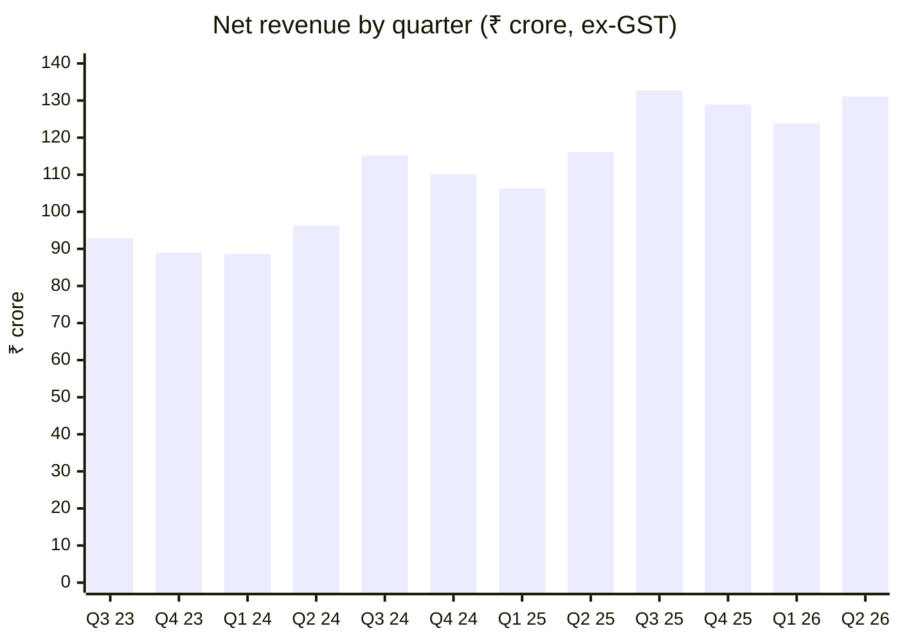
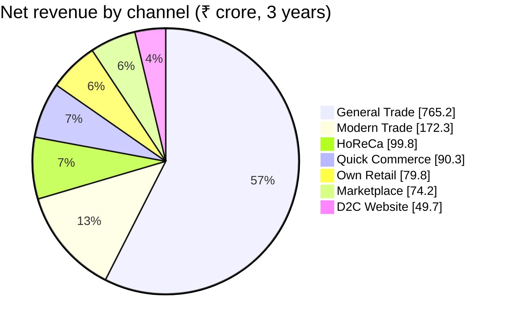
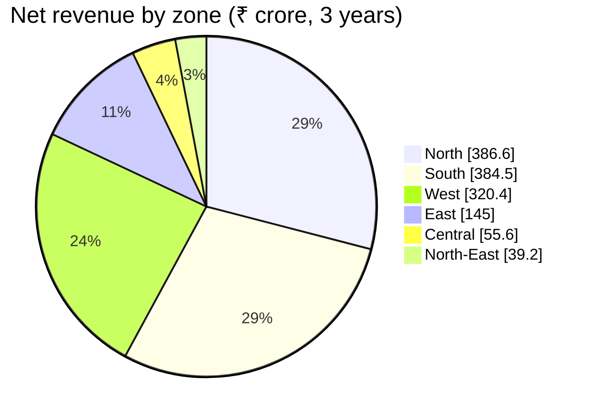
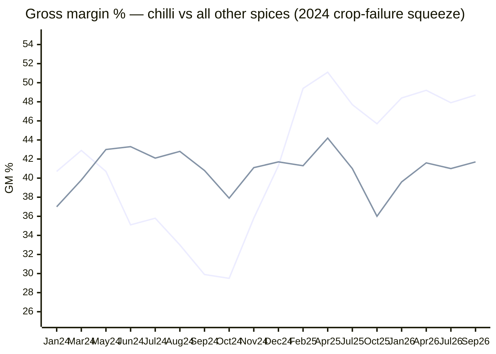
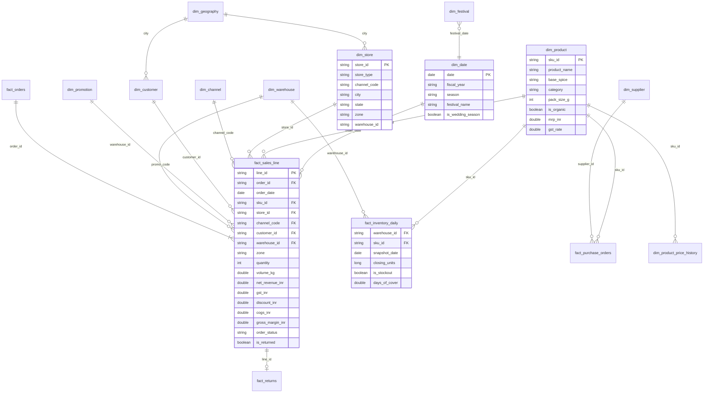

# SpiceRoute India — Retail Lakehouse on Databricks Free Edition

End-to-end Databricks project for a fictional Indian spice company. **SpiceRoute India** sells 147 SKUs through 7 channels across 6 zones.

The project covers:
1. **Synthetic big data:** about 25M sales lines, 10M orders and 1M customers over 3 years.
2. A **medallion lakehouse** built with a Lakeflow Declarative Pipeline (bronze → silver → gold).
3. **Governed KPIs** as Unity Catalog metric views.
4. **Demand forecasting** with Prophet and the `ai_forecast()` baseline, tracked in MLflow.
5. **Reorder and stockout recommendations**.
6. An **AI/BI dashboard**, a **Genie space** and a **Databricks App**.

> Workspace: `https://dbc-821c89ac-7917.cloud.databricks.com` · CLI profile: `brilworks` · Catalog: `spiceroute`
> Everything is deployed as a Declarative Automation Bundle (`databricks.yml`). The project is fully isolated from other projects (own workspace, own catalog).

---

## 📌 Project status (updated 2026-10-05)

| # | Phase | Status | What exists / result |
|---|---|---|---|
| 0 | Foundation | ✅ Done | Bundle `spiceroute_india`; catalog `spiceroute` with schemas `bronze`, `silver`, `gold`, `ml`, `semantic`, `synthetic`; volume `bronze.raw_landing` |
| 1 | Synthetic data generation | ✅ Done | Job `spiceroute_generate_data` (3 serverless tasks). Bronze holds 25.47M raw lines, including injected data-quality issues |
| 2 | Medallion pipeline | ✅ Done | Pipeline `spiceroute_medallion` (serverless, SQL). Full run takes about 4 min. Gold has 25.18M clean lines |
| 3 | Semantic layer | ✅ Done | Metric views `sales_metrics`, `order_metrics`, `inventory_metrics`, which reconcile to gold |
| 4a | `ai_forecast()` baseline | ✅ Done | `ml.ai_forecast_baseline`: 882 series × 12 weeks |
| 4b | Prophet forecast + backtest + MLflow | 🔄 Re-running | First run failed on a library conflict (`cmdstanpy` 1.3 vs the CmdStan bundled with Prophet). Fixed by pinning `cmdstanpy==1.2.5` |
| 4c | Reorder recommendations | ⏳ Waits on 4b | `ml.reorder_recommendation`, plus the `ml.reorder_overrides` table for the app |
| 5 | AI/BI dashboard (6 pages) | 🟡 Built, not deployed | `dashboards/build_dashboard.py` generates the JSON (16 datasets, 6 pages + filters). 12 gold datasets pass `--test`. The 4 ML datasets are waiting on the forecast tables |
| 6 | Genie space "Ask SpiceRoute" | ⏳ To do | Instructions, trusted SQL, benchmark questions |
| 7 | Data quality monitoring | 🟡 Partly done | Pipeline expectations and quarantine tables plus `gold.dq_summary` are done. SQL alerts and the Data Health dashboard page are still to do |
| 8 | Databricks App "Demand Planner" | ⏳ To do | Python (Streamlit) app: forecast explorer, reorder approvals, Genie chat |
| 9 | End-to-end orchestration job | ⏳ To do | One manually triggered job: generate → pipeline → metric views → forecast → reorder |
| 10 | Docs | 🟡 This README | The final version will be updated with dashboard, Genie and app links |

### Remaining work, in order
1. Finish the Prophet run (fix applied, now re-running), then check WAPE against the seasonal-naive baseline and confirm the MLflow run.
2. Build the reorder recommendations and check the stockout-risk distribution.
3. Rerun `python3 dashboards/build_dashboard.py --test` once the ML tables exist, add `resources/dashboard.dashboard.yml` (dataset_catalog `spiceroute`, dataset_schema `gold`), then deploy and publish.
4. Create the Genie space on the gold tables and metric views, with instructions, sample questions and trusted SQL. Then link it to the dashboard.
5. Add SQL alerts: high stockout risk, forecast WAPE above 25%, DQ drop rate above 1%.
6. Build and deploy the Demand Planner app as a bundle resource, and grant its service principal access.
7. Add the `spiceroute_end_to_end` job and run it once end to end.
8. Final README pass: links, screenshots or descriptions, and the demo script.

---

## 1. Business story

| Aspect | Detail |
|---|---|
| Company | SpiceRoute India (fictional), Mumbai HQ, packaged spices |
| Products | 147 SKUs: 46 base spices × pack sizes (1g saffron to 1kg), plus an organic line launched Aug 2024 |
| Categories | Ground Spices, Whole Spices, Masala Blends, Seasonings, Premium |
| Channels | General Trade (distributors), Modern Trade, Own Retail, HoReCa, Quick Commerce, Marketplace, D2C Website |
| Geography | 6 zones, 32 states/UTs, 111 cities, 8 distribution centres |
| Period | Actuals 2023-10-01 → 2026-09-30 (Indian FY Apr–Mar); forecasts to Dec 2026 |
| Money | INR. MRP includes GST. **Revenue = net revenue excluding GST**, after channel margin and promotional discount |

### Stories built into the data
1. **Festivals drive demand.** Diwali, Navratri, Durga Puja (East), Ganesh Chaturthi (West), Onam and Pongal (South), Eid, Holi and Christmas each lift specific spices. For example, Eid lifts biryani masala and saffron, Durga Puja lifts panch phoron, and Holi lifts thandai spices. B2B sell-in leads consumer sell-out by about 10 days.
2. **Regional taste.** Sambar powder is about 47% of the South's volume among core spices, against about 6% elsewhere. Panch phoron is popular in the East, goda masala in the West, and garam masala in the North.
3. **2024 chilli crop failure (Andhra/Telangana).** Raw chilli cost rose by up to +38%. Suppliers refused allocations, and a low-grade alternate supplier (grade C) was used. The effects:
   - stockouts in South and West DCs (fill rate down to 62–67%)
   - quality returns increased
   - chilli gross margin fell from 44.6% to 29.5%
   - an MRP increase of +12% in July 2024 later restored the margin.
4. **Channel shift.** Quick commerce (+20% per store per year, plus new dark stores), marketplace (+30%) and D2C (+22%) grow faster than General Trade (+4%).
5. **Promotions.** Festival promos and flash sales lift revenue, followed by a post-promo dip.
6. **Seasonality.** Warming spices peak in winter, chaat and jaljeera in summer, tea masala in the monsoon, and pickle spices in March–May.

### Headline numbers (from gold)


*(Quarter labels are calendar quarters by start month: Oct 2023 … Jul 2026.)*

| Fiscal year | Net revenue | Gross margin |
|---|---|---|
| FY23-24 (Oct–Mar only) | ₹181.9 cr | 39.2% |
| FY24-25 | ₹410.4 cr | 41.1% |
| FY25-26 | ₹484.0 cr (+18%) | 41.1% |
| FY26-27 (Apr–Sep) | ₹254.9 cr | 42.7% |






*Line 1 = chilli SKUs, line 2 = all other spices.*

---

## 2. Architecture

```mermaid
flowchart LR
    subgraph GEN["① spiceroute_generate_data (serverless job)"]
        D1[gen_dims.py<br/>Faker en_IN · reference data<br/>stores · 1M customers · promos]
        D2[gen_sales.py<br/>demand model → 10.4M orders<br/>→ 25.5M lines · returns]
        D3[gen_inventory.py<br/>(s,S) replenishment sim<br/>inventory · purchase orders]
        D1 --> D2 --> D3
    end
    V[("UC Volume<br/>spiceroute.bronze.raw_landing<br/>Parquet · JSON · CSV")]
    GEN --> V
    subgraph LDP["② spiceroute_medallion (Lakeflow Declarative Pipeline, serverless SQL)"]
        B["BRONZE<br/>Auto Loader streaming tables<br/>+ reference MVs"]
        S["SILVER<br/>typed · deduped · standardised<br/>expectations + quarantine"]
        G["GOLD<br/>star schema · facts · aggregates<br/>liquid clustering"]
        B --> S --> G
    end
    V --> B
    G --> MV["③ SEMANTIC<br/>metric views<br/>sales · orders · inventory"]
    subgraph FC["④ spiceroute_forecast (serverless job)"]
        P[Prophet per SKU×zone<br/>applyInPandas · festivals as holidays]
        A[ai_forecast() baseline<br/>SQL warehouse]
        R[reorder_recommendations]
        P --> R
    end
    G --> FC
    FC --> ML[("ml.demand_forecast<br/>ml.forecast_accuracy<br/>ml.reorder_recommendation")]
    P -. metrics .-> MLF[(MLflow experiment)]
    MV --> DB["⑤ AI/BI Dashboard"]
    ML --> DB
    MV --> GN["⑥ Genie: Ask SpiceRoute"]
    ML --> GN
    ML --> APP["⑧ Databricks App<br/>Demand Planner"]
    APP -->|overrides| OV[(ml.reorder_overrides)]
```

### Unity Catalog layout

```
spiceroute
├── bronze      raw_landing volume + *_raw tables (Auto Loader / read_files)
├── silver      cleaned entities + orders_quarantine, sales_lines_quarantine
├── gold        dim_* / fact_* / agg_* / dq_summary
├── semantic    sales_metrics, order_metrics, inventory_metrics (metric views)
├── ml          demand_forecast, forecast_backtest, forecast_accuracy, ai_forecast_baseline,
│               reorder_recommendation, reorder_overrides
└── synthetic   generator ground truth / helper tables (not used by analytics)
```

### Platform choices for Free Edition
- **Serverless everywhere:** jobs use `environments` (client 4) and the pipeline is `serverless: true`. There are no clusters.
- **Small warehouse:** dashboards and Genie read pre-aggregated gold tables and metric views, never the 25M-row fact table directly.
- **Manual triggers only:** jobs have no schedules, to save the daily compute quota.

---

## 3. Data volumes

| Table | Rows |
|---|---|
| `bronze.sales_lines_raw` | 25,466,593 |
| `silver.sales_lines` | 25,258,597 |
| `gold.fact_sales_line` | 25,183,186 |
| `gold.fact_orders` | 10,434,220 |
| `gold.agg_sales_daily` | 3,881,046 |
| `gold.fact_inventory_daily` | 1,288,896 |
| `gold.dim_customer` | 1,000,000 |
| `gold.fact_returns` | 429,986 |
| `gold.fact_purchase_orders` | 44,145 |
| `gold.dim_store` | 2,134 |
| `gold.dim_product` | 147 |

### Data-quality issues injected and caught

| Source | Issue | Rows | Handling |
|---|---|---|---|
| sales_lines | exact duplicate lines | 126,818 | deduplicated in silver → quarantine |
| sales_lines | missing price | 32,951 | expectation DROP → quarantine |
| sales_lines | unknown SKU | 27,929 | expectation DROP → quarantine |
| sales_lines | non-positive quantity | 20,298 | expectation DROP → quarantine |
| orders | missing store_id | 31,492 | expectation DROP → `orders_quarantine` |
| sales_lines | late-arriving (next month's batch folder) | 251,971 | accepted, flagged `arrived_late` |
| stores | messy state names (`Tamilnadu`, `WB`, `Orissa` …) | 102 | standardised in silver |

---

## 4. Data model (gold star schema)



Design notes:
- **Business keys as join keys.** Tables join on `sku_id`, `store_id` and similar, which makes Genie and ad-hoc SQL simpler.
- **Price history.** MRP history is kept as SCD Type 2 in `dim_product_price_history`. Monthly cost comes from `silver.product_costs`.
- **Clustering.** Large tables use liquid clustering: `fact_sales_line (order_date, sku_id)` and `agg_sales_daily (order_date, zone)`.

| Gold aggregate | Grain | Used by |
|---|---|---|
| `agg_sales_daily` | day × SKU × zone × channel | dashboard, Genie, `sales_metrics` |
| `agg_sales_monthly` | month × category × state × channel | executive trends, map |
| `agg_sales_weekly_sku_zone` | week × SKU × zone | forecasting input |
| `agg_promo_effectiveness` | promotion | promo lift vs 28-day baseline |
| `agg_festival_uplift` | festival × zone × spice | festival analysis |
| `agg_customer_rfm` | customer | RFM segments |
| `agg_inventory_weekly` | week × warehouse × SKU | fill rate, stockout days |
| `agg_margin_monthly` | month × base spice | raw-material index vs margin |
| `dq_summary` | table × reason | data health |

---

## 5. Forecasting design

| Item | Choice |
|---|---|
| Target | Weekly units per SKU × zone (882 series) |
| Horizon | 12 weeks (trained through the week of 2026-09-21) |
| Model | Prophet: multiplicative yearly seasonality, Indian festivals as holidays (festival week and the week before), `promo_share` regressor |
| Short-history SKUs | Recent 8-week mean (products launched in 2024–25) |
| Baselines | Seasonal naive (same week last year); Databricks `ai_forecast()` |
| Validation | Rolling-origin backtest, 3 folds × 12 weeks; WAPE, bias, 80% interval coverage |
| Tracking | MLflow experiment `/Users/raj.s@brilworks.com/spiceroute/demand_forecast` |
| Inventory link | Zone forecast allocated to DCs by recent demand share, giving lead-time demand + safety stock − (on hand + open POs) = reorder quantity and stockout risk |

---

## 6. Repository layout

```
db-prac/
├── databricks.yml                     bundle (target free → profile brilworks)
├── PLAN.md                            original plan
├── README.md                          this file
├── resources/
│   ├── generate_data.job.yml          job: synthetic data (3 tasks)
│   ├── medallion.pipeline.yml         Lakeflow Declarative Pipeline
│   └── forecast.job.yml               job: Prophet + ai_forecast + reorder; MLflow experiment
└── src/
    ├── 01_generate/                   spice_common.py · gen_dims.py · gen_sales.py · gen_inventory.py
    ├── 02_pipeline/transformations/   01_bronze.sql · 02_silver.sql · 03_gold_dims.sql · 04_gold_facts.sql · 05_gold_aggregates.sql
    ├── 03_forecast/                   train_forecast.py · ai_forecast_baseline.sql · reorder_recommendations.py
    └── 04_semantic/                   metric_views.sql
```

## 7. How to run

```bash
databricks bundle validate --strict --profile brilworks
databricks bundle deploy --profile brilworks
databricks bundle run spiceroute_generate_data --profile brilworks      # ~15 min, 25M lines
databricks bundle run spiceroute_medallion --profile brilworks          # ~4 min
databricks bundle run spiceroute_forecast --profile brilworks
```

Small test run: `databricks bundle run spiceroute_generate_data --params target_lines=500000 --profile brilworks`.

After regenerating the data, run the pipeline with a full refresh (`--full-refresh-all`), because the raw files are overwritten in place.

Teardown: `databricks bundle destroy --profile brilworks`, then run `DROP CATALOG spiceroute CASCADE`.
